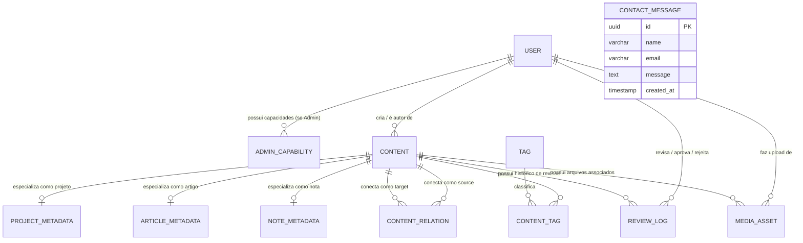

# Modelo de Domínio — MyDevLab V1

> Este documento sintetiza o modelo conceitual e lógico do MyDevLab V1, derivado do [Escopo](file:///c:/Users/Rainha/Desktop/teste/MyDevHub/docs/domain/scope.md), das [Regras de Negócio](file:///c:/Users/Rainha/Desktop/teste/MyDevHub/docs/domain/business-rules.md) e das decisões de arquitetura alinhadas na fase de definição.

---

## 1. Visão Geral da Arquitetura de Domínio

O domínio do MyDevLab é estruturado em quatro núcleos fundamentais:

1. **Identidade e Autorização:** Contas internas (`User`) com níveis hierárquicos (`Founder`, `Admin`, `Author`), controle de capacidades delegadas (`AdminCapability`) e proteção de recuperação via segredo criptografado.
2. **Núcleo Editorial Polimórfico:** Uma entidade central `Content` unificando metadados comuns, ciclo editorial e visibilidade, estendida por tabelas especializadas (`Project`, `Article`, `Note`).
3. **Rede de Conhecimento (Grafo e Taxonomia):** Relações bidirecionais simétricas entre conteúdos (`ContentRelation`) e taxonomia compartilhada (`Tag` e `ContentTag`).
4. **Governança e Operações:** Histórico de auditoria imutável de aprovações/rejeições (`ReviewLog`), catálogo de mídia protegida (`MediaAsset`) e canal de comunicação seguro (`ContactMessage`).

---

## 2. Diagrama Entidade-Relacionamento (Conceitual)

---

## 3. Especificação das Entidades

### 3.1 Núcleo de Identidade & Acesso

#### `User`
Representa as contas internas autorizadas a acessar o sistema.
* **`id`** (UUID, PK)
* **`email`** (VARCHAR(254), UNIQUE, NOT NULL)
* **`password_hash`** (TEXT, NOT NULL)
* **`role`** (ENUM: `'founder'`, `'recovery'`, `'admin'`, `'author'`, NOT NULL)
* **`name`** (VARCHAR(120), NOT NULL)
* **`is_active`** (BOOLEAN, NOT NULL, DEFAULT true) — Quando desativada (`false`), impede autenticação mantendo autoria histórica (soft-delete).
* **`mfa_secret`** (TEXT, NULLABLE) — Chave TOTP para autenticação multifator do Founder.
* **`recovery_secret_hash`** (TEXT, NULLABLE) — Hash seguro (argon2/bcrypt) do segredo de recuperação (exclusivo para a conta `recovery`).
* **`created_at`** (TIMESTAMPTZ, NOT NULL, DEFAULT now())
* **`updated_at`** (TIMESTAMPTZ, NOT NULL, DEFAULT now())

#### `AdminCapability`
Permissões delegadas individualmente pelo Founder para contas com papel `'admin'`.
* **`id`** (UUID, PK)
* **`user_id`** (UUID, FK -> User.id, ON DELETE CASCADE)
* **`capability`** (ENUM, NOT NULL):
  - `'review_queue.view'`: consultar fila de aprovação;
  - `'content.approve'`: aprovar/rejeitar conteúdo (exceto o próprio);
  - `'content.edit_others'`: editar conteúdo de outros autores;
  - `'tags.manage'`: gerenciar/excluir tags globais;
  - `'relations.manage'`: gerenciar relações entre conteúdos de terceiros;
  - `'media.manage'`: gerenciar arquivos de mídia da plataforma;
  - `'content.archive'`: arquivar e restaurar conteúdos.
* **`granted_at`** (TIMESTAMPTZ, NOT NULL, DEFAULT now())
* *Constraint:* UNIQUE(`user_id`, `capability`)

---

### 3.2 Núcleo Editorial Polimórfico

#### `Content` (Tabela Base)
Representa qualquer unidade editorial no sistema, permitindo relacionamentos polimórficos de chave estrangeira simples e feed unificado.
* **`id`** (UUID, PK)
* **`type`** (ENUM: `'project'`, `'article'`, `'note'`, NOT NULL)
* **`slug`** (VARCHAR(160), UNIQUE, NOT NULL)
* **`title`** (VARCHAR(240), NOT NULL)
* **`summary`** (TEXT, NOT NULL)
* **`editorial_status`** (ENUM: `'draft'`, `'pending_review'`, `'rejected'`, `'published'`, `'archived'`, NOT NULL, DEFAULT `'draft'`)
* **`visibility`** (ENUM: `'public'`, `'private'`, NOT NULL, DEFAULT `'public'`)
  - *Regra:* `notes` podem ser criadas com visibilidade `'private'`. Conteúdo privado é acessível estritamente ao seu autor.
* **`author_id`** (UUID, FK -> User.id, NOT NULL, ON DELETE RESTRICT)
* **`published_at`** (TIMESTAMPTZ, NULLABLE) — Preenchido na primeira aprovação pública.
* **`created_at`** (TIMESTAMPTZ, NOT NULL, DEFAULT now())
* **`updated_at`** (TIMESTAMPTZ, NOT NULL, DEFAULT now())

#### `ProjectMetadata` (Extensão para Projetos)
* **`content_id`** (UUID, PK, FK -> Content.id, ON DELETE CASCADE)
* **`repository_url`** (VARCHAR(255), NULLABLE)
* **`live_url`** (VARCHAR(255), NULLABLE)
* **`tech_stack`** (TEXT[], NOT NULL, DEFAULT '{}')
* **`architecture_notes`** (TEXT, NULLABLE)
* **`challenges`** (TEXT, NULLABLE)

#### `ArticleMetadata` (Extensão para Artigos)
* **`content_id`** (UUID, PK, FK -> Content.id, ON DELETE CASCADE)
* **`body`** (TEXT, NOT NULL)
* **`reading_minutes`** (INTEGER, NULLABLE)
* **`canonical_url`** (VARCHAR(255), NULLABLE)

#### `NoteMetadata` (Extensão para Notas)
* **`content_id`** (UUID, PK, FK -> Content.id, ON DELETE CASCADE)
* **`body`** (TEXT, NOT NULL)

---

### 3.3 Núcleo de Auditoria e Revisão

#### `ReviewLog`
Registro imutável de todas as decisões tomadas sobre um conteúdo na fila editorial.
* **`id`** (UUID, PK)
* **`content_id`** (UUID, FK -> Content.id, NOT NULL, ON DELETE CASCADE)
* **`reviewer_id`** (UUID, FK -> User.id, NOT NULL, ON DELETE RESTRICT)
* **`decision`** (ENUM: `'approved'`, `'rejected'`, NOT NULL)
* **`reason`** (TEXT, NULLABLE) — Obrigatório para `'rejected'`, com tamanho mínimo de 20 caracteres.
* **`created_at`** (TIMESTAMPTZ, NOT NULL, DEFAULT now())

---

### 3.4 Núcleo de Taxonomia e Rede (Grafo)

#### `Tag`
Vocabulário controlado e compartilhado entre todos os tipos de conteúdo.
* **`id`** (UUID, PK)
* **`name`** (VARCHAR(60), NOT NULL, UNIQUE)
* **`slug`** (VARCHAR(60), NOT NULL, UNIQUE)
* **`created_at`** (TIMESTAMPTZ, NOT NULL, DEFAULT now())

#### `ContentTag` (Associação Muitos-para-Muitos)
* **`content_id`** (UUID, FK -> Content.id, NOT NULL, ON DELETE CASCADE)
* **`tag_id`** (UUID, FK -> Tag.id, NOT NULL, ON DELETE CASCADE)
* *Primary Key:* (`content_id`, `tag_id`)

#### `ContentRelation` (Arestas do Grafo)
Relações bidirecionais/simétricas entre nós de conteúdo.
* **`id`** (UUID, PK)
* **`source_id`** (UUID, FK -> Content.id, NOT NULL, ON DELETE CASCADE)
* **`target_id`** (UUID, FK -> Content.id, NOT NULL, ON DELETE CASCADE)
* **`relation_type`** (VARCHAR(50), NOT NULL, DEFAULT `'related'`) — Exemplos: `'related'`, `'case_study'`, `'prerequisite'`.
* **`created_at`** (TIMESTAMPTZ, NOT NULL, DEFAULT now())
* *Constraints de Integridade:*
  - `CHECK (source_id <> target_id)` (impede auto-relação);
  - Ordem canônica ou índice condicional para garantir par único simétrico: `UNIQUE (LEAST(source_id, target_id), GREATEST(source_id, target_id))`.

---

### 3.5 Núcleo de Mídia e Arquivos

#### `MediaAsset`
Arquivos enviados, validados e referenciados nos conteúdos.
* **`id`** (UUID, PK)
* **`uploader_id`** (UUID, FK -> User.id, NOT NULL, ON DELETE RESTRICT)
* **`associated_content_id`** (UUID, FK -> Content.id, NULLABLE, ON DELETE SET NULL)
* **`file_name`** (VARCHAR(255), NOT NULL)
* **`file_path`** (VARCHAR(500), NOT NULL) — Caminho no volume Docker local (`/uploads`).
* **`mime_type`** (VARCHAR(100), NOT NULL) — Restrito a imagens (`image/jpeg`, `image/png`, `image/webp`, `image/svg+xml`).
* **`byte_size`** (INTEGER, NOT NULL) — Máximo de 5MB (5.242.880 bytes).
* **`alt_text`** (VARCHAR(255), NULLABLE)
* **`created_at`** (TIMESTAMPTZ, NOT NULL, DEFAULT now())

---

### 3.6 Núcleo de Contato

#### `ContactMessage`
Mensagens recebidas pela área pública destinadas ao Founder.
* **`id`** (UUID, PK)
* **`name`** (VARCHAR(120), NOT NULL)
* **`email`** (VARCHAR(254), NOT NULL)
* **`message`** (TEXT, NOT NULL)
* **`created_at`** (TIMESTAMPTZ, NOT NULL, DEFAULT now())

---

## 4. Invariantes e Regras de Integridade do Domínio

1. **Visibilidade do Grafo Público:** Um nó só é selecionável pelo visitante e renderizado na visualização do grafo se e somente se:
   `content.editorial_status = 'published' AND content.visibility = 'public'`.
   Uma aresta (`ContentRelation`) só é exposta se ambos os nós (`source_id` e `target_id`) satisfizerem essa condição.
2. **Segregação na Aprovação:** Em nível de aplicação e validação, `review_logs.reviewer_id != content.author_id`, a menos que o `reviewer.role == 'founder'`.
3. **Reversão por Edição:** Qualquer alteração em `title`, `slug`, `summary`, metadados de corpo ou imagem de um item cujo `editorial_status == 'published'` altera atomicamente seu status para `'pending_review'`, removendo-o imediatamente da área pública até nova aprovação.
4. **Isolamento de Notas Privadas:** Conteúdos onde `type == 'note' AND visibility == 'private'` nunca são retornados por endpoints públicos ou listagens gerais administrativas, sendo restritos ao `author_id`.
5. **Acesso Exclusivo à Conta Recovery:** A conta com `role == 'recovery'` não possui sessão administrativa geral; autenticação só é válida contra a rota de recuperação credencial com apresentação do `recovery_secret`.

